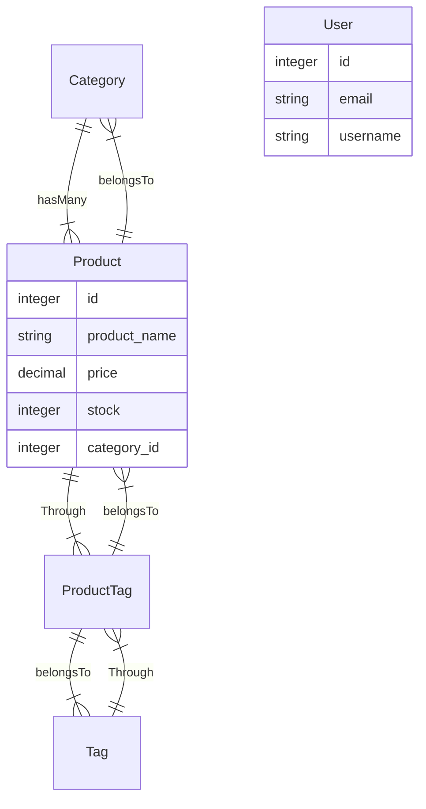

# cms-style-blog

 

# Table of contents

- [Purpose](#purpose)
- [Usage](#user-story)
- [Technologies Used](#technologies-used)
- [Run Instructions](#run-instructions)
- [Test Instructions](#test-instructions)
- [More Information](#more-information)
- [Contributors](#contributors)
- [License](#license)

## Purpose

To build the back end for an e-commerce site.

## User Story

## Technologies Used

- Java Script
- NodeJs (Inquirer for command prompt)
- Mysql2
- Sequalize (ORM)

Object-relational mapping (ORM) is a technique that allows developers to convert data between incompatible type systems using object-oriented programming principles. This will allow to set up and completely manage objects using JavaScript, while Sequelize translates your code into database schema and queries using SQL.

## Run Instructions

npm start

## Test Instructions

Please refer [here for insomania collection](./Assets//Insomnia_collection) to test all rest calls of this application

Please refer below a walkthrough videos of test runs of deployed application:

<!-- https://user-images.githubusercontent.com/38411252/155857818-1dc83283-88be-4fe5-b558-155b3658315c.mp4

https://user-images.githubusercontent.com/38411252/155857834-e21277bf-2734-4633-bd47-eb5a16a8a352.mp4

https://user-images.githubusercontent.com/38411252/155857838-e2a86ab1-f785-448a-8039-3fa793f10e47.mp4

https://user-images.githubusercontent.com/38411252/155857859-f0d7a8d9-d100-4cd0-9126-68a6498eb1ea.mp4 -->

## More Information

Please find below acceptance criteria of project:

### Database Design

### Wiremock

<!-- 

 -->

## Contributors

Krupali

## License

Please consult the attached LICENSE file for details. All rights not explicitly granted by the MIT,Apache License are reserved by Original Author.

Copyright (c) 2021
