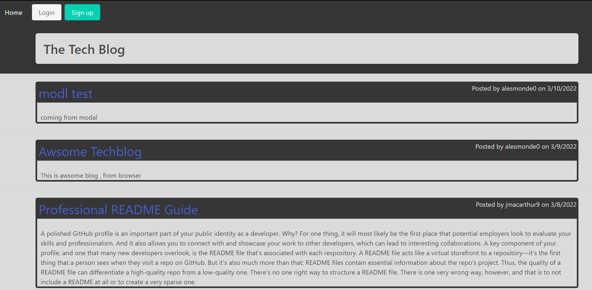
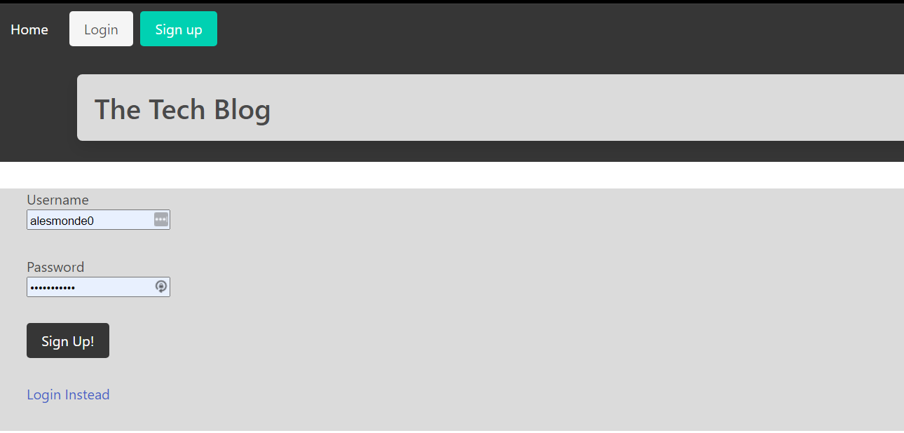
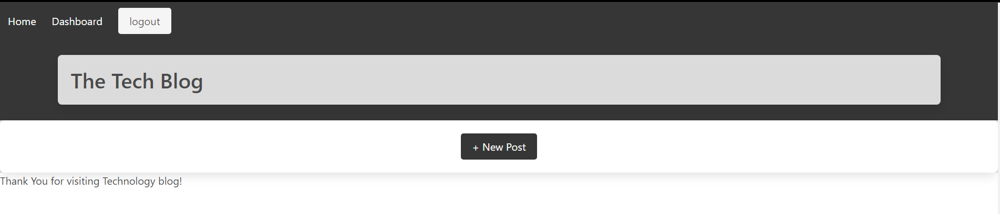
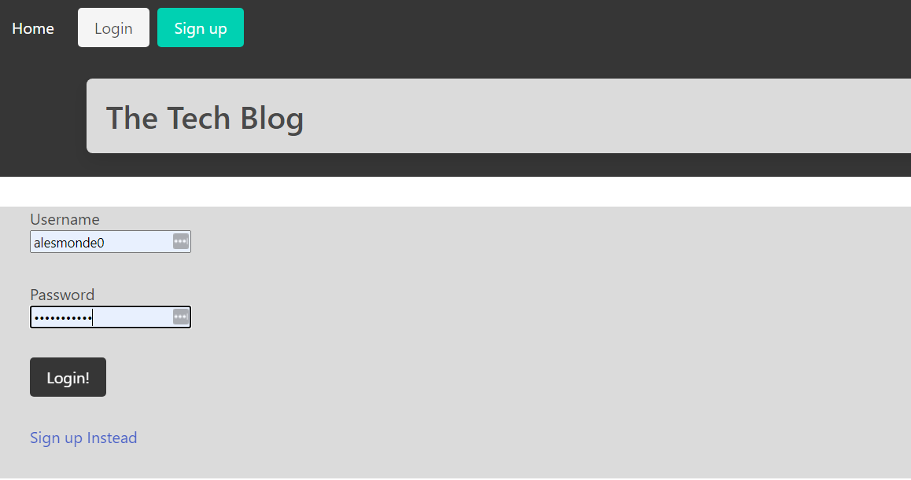
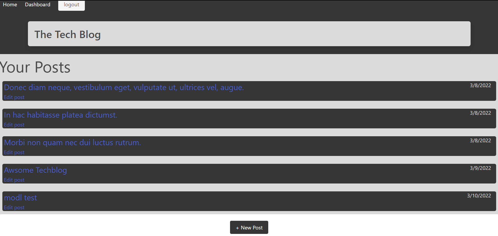
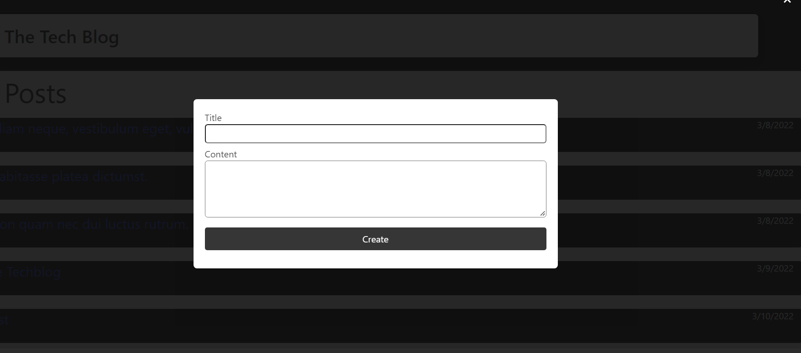
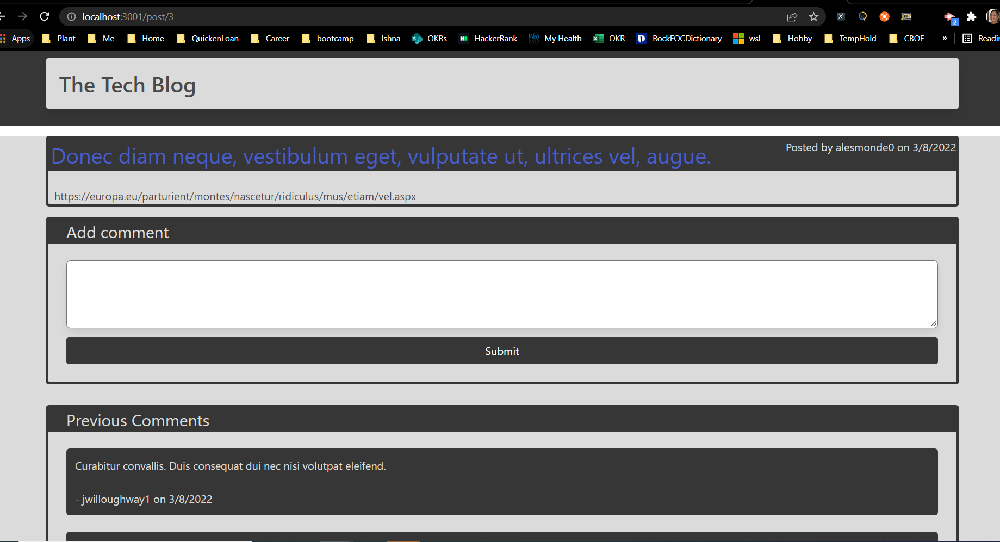
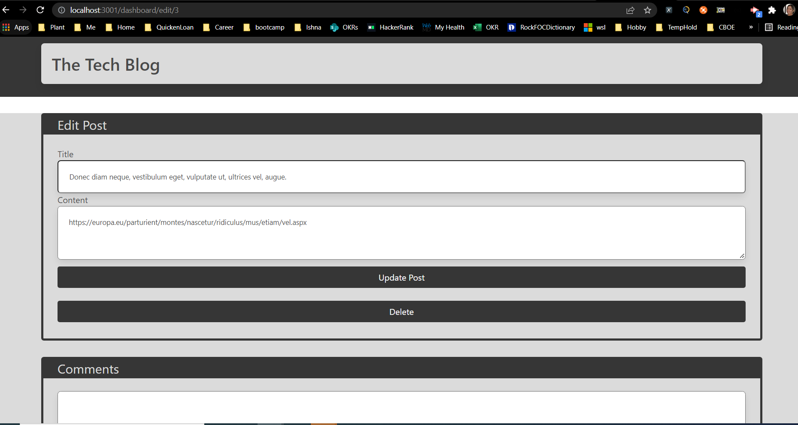

# cms-style-blog

This is CMS-style blog site similar to a Wordpress site, where developers can publish their blog posts and comment on other developers’ posts as well.
 

# Table of contents

- [Purpose](#purpose)
- [Application Details](#application-details)
- [Technologies Used](#technologies-used)
- [Run Instructions](#run-instructions)
- [Test Instructions](#test-instructions)
- [More Information](#more-information)
- [Contributors](#contributors)
- [License](#license)

## Purpose

To build the site to add posts and comments to an existing posts

## Application details

Please use application here
https://fierce-plateau-75029.herokuapp.com/

When user landed on home page, then user will see with list of posts and option to either sign up or login:

When user clicks on sign up, then user will be given to enter user name and password :

Once User sign up, you will be landed on dashboard page:

If user click on signout then user will be landed on home page.
if user click on login page then user will be given an option with username and password:

Once user logs in, user will be landed on dashboard page

Clicking on New post will open modal and given title and content

Once user creates new post, it will be landed on dashboard page with newly added post. Clicking on post will open new page with post details. You will see an option to add a comment and you can also previously added comments

From dashboard if user clicks on edit post, user will land on edit post page, where user can either update post or delete post

## User Story

    AS A developer who writes about tech
    I WANT a CMS-style blog site
    SO THAT I can publish articles, blog posts, and my thoughts and opinions

## Technologies Used

- Java Script
- NodeJs (Inquirer for command prompt)
- Mysql2
- Sequalize (ORM)

This site is completely built from scratch and deployed it to Heroku. This site's development follows the MVC paradigm in its architectural structure, using Handlebars.js as the templating language, Sequelize as the ORM, and the express-session npm package for authentication.

## Run Instructions

npm start

## More Information

    Please find below acceptance criteria of project:
    GIVEN a CMS-style blog site
    WHEN I visit the site for the first time
    THEN I am presented with the homepage, which includes existing blog posts if any have been posted; navigation links for the homepage and the dashboard; and the option to log in
    WHEN I click on the homepage option
    THEN I am taken to the homepage
    WHEN I click on any other links in the navigation
    THEN I am prompted to either sign up or sign in
    WHEN I choose to sign up
    THEN I am prompted to create a username and password
    WHEN I click on the sign-up button
    THEN my user credentials are saved and I am logged into the site
    WHEN I revisit the site at a later time and choose to sign in
    THEN I am prompted to enter my username and password
    WHEN I am signed in to the site
    THEN I see navigation links for the homepage, the dashboard, and the option to log out
    WHEN I click on the homepage option in the navigation
    THEN I am taken to the homepage and presented with existing blog posts that include the post title and the date created
    WHEN I click on an existing blog post
    THEN I am presented with the post title, contents, post creator’s username, and date created for that post and have the option to leave a comment
    WHEN I enter a comment and click on the submit button while signed in
    THEN the comment is saved and the post is updated to display the comment, the comment creator’s username, and the date created
    WHEN I click on the dashboard option in the navigation
    THEN I am taken to the dashboard and presented with any blog posts I have already created and the option to add a new blog post
    WHEN I click on the button to add a new blog post
    THEN I am prompted to enter both a title and contents for my blog post
    WHEN I click on the button to create a new blog post
    THEN the title and contents of my post are saved and I am taken back to an updated dashboard with my new blog post
    WHEN I click on one of my existing posts in the dashboard
    THEN I am able to delete or update my post and taken back to an updated dashboard
    WHEN I click on the logout option in the navigation
    THEN I am signed out of the site
    WHEN I am idle on the site for more than a set time
    THEN I am able to view comments but I am prompted to log in again before I can add, update, or delete comments

### Wiremock

## Contributors

Krupali

## License

Please consult the attached LICENSE file for details. All rights not explicitly granted by the MIT,Apache License are reserved by Original Author.

Copyright (c) 2021
